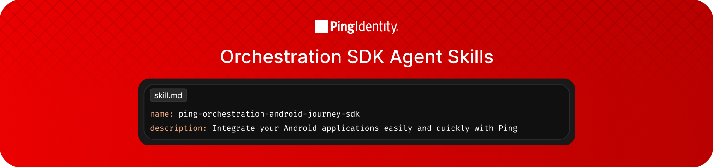

<p align="center">
  
</p>

# Ping _Orchestration_ SDK Agent Skills

These skills help AI-powered coding assistants (such as GitHub Copilot, Claude Code, Gemini CLI, Cursor) integrate your mobile and web applications with Ping's orchestration platforms (PingOne DaVinci, PingOne Advanced Identity Cloud, and Software PingAM).

> [!NOTE]
>
> As Agent Skills "uplevel" the utility of coding assistants, we are actively building skills and will continue releasing new ones. If you already use a skill to build with Ping and you find it useful, or if you want to suggest a skill or enhance an existing one, we want to hear from you!

## What are Agent Skills?

[Agent Skills](https://agentskills.io/home) are an [open standard](https://agentskills.io/specification) for giving AI agents new capabilities and domain expertise. Each skill is a folder containing a `SKILL.md` file with structured instructions, code patterns, and best practices that AI agents can load on demand.

This repository contains Ping Identity's Ping Orchestration SDK agent skills for client-side SDK integration across Android, iOS, and ReactJS.

Learn more at [agentskills.io](https://agentskills.io) and [skills.sh](https://skills.sh)

## Try it out

### Prerequisites

Depending on the skill your AI agent uses, you'll need the following:
- If using PingOne AIC-related skills, a PingOne AIC environment.
- If using PingOne related skills, a PingOne environment. Don't have a tenant? [Sign up for a free trial here](https://www.pingidentity.com/en/try-ping.html).
- Access to an AI coding assistant (GitHub Copilot, Claude Code, Cursor, etc.)

### Installation Guide

#### GitHub Copilot

1. **Via Skills CLI (recommended)**
   ```bash
   npx skills add pingidentity/ping-sdk-agent-skills
   ```
   Or install the plugin directly:
   ```bash
   npx skills add pingidentity/ping-sdk-agent-skills/plugins/ping-orchestration-sdks
   ```

2. **Manual Installation**
   ```bash
   git clone https://github.com/pingidentity/ping-sdk-agent-skills.git
   cp -r ping-sdk-agent-skills/plugins/ping-orchestration-sdks/skills/* ~/.copilot/skills/
   ```

#### Claude Code

1. **Via Skills CLI**
   ```bash
   npx skills add pingidentity/ping-sdk-agent-skills
   
    # Install a particular skill
    npx skills add pingidentity/ping-sdk-agent-skills/plugins/ping-orchestration-sdks/skills/ping-sdk-ios
    npx skills add pingidentity/ping-sdk-agent-skills/plugins/ping-orchestration-sdks/skills/ping-sdk-android
    npx skills add pingidentity/ping-sdk-agent-skills/plugins/ping-orchestration-sdks/skills/ping-sdk-js
    npx skills add pingidentity/ping-sdk-agent-skills/plugins/ping-orchestration-sdks/skills/ping-sdk-router
    npx skills add pingidentity/ping-sdk-agent-skills/plugins/ping-orchestration-sdks/skills/ping-orchestration-reactjs-js-journey-sdk
    npx skills add pingidentity/ping-sdk-agent-skills/plugins/ping-orchestration-sdks/skills/ping-orchestration-reactjs-js-davinci-sdk
    npx skills add pingidentity/ping-sdk-agent-skills/plugins/ping-orchestration-sdks/skills/forgerock-to-ping-journey-migration
    ```

2. **Local Testing**
   ```bash
   npx skills add /path/to/agent-skills
   ```
   Then reference skills in Claude Code chat prompts.

#### Cursor

Cursor automatically discovers skills from `.cursor-plugin/` configurations in this repository.

1. **Install via Skills CLI**
   ```bash
   npx skills add pingidentity/ping-sdk-agent-skills
   ```

2. **Reference in Cursor**
   Open Cursor and mention the Ping Orchestration SDK skills in your prompts (e.g., "Use the ping-orchestration-android-journey-sdk skill to help me build an Android app")

### Using the Skills

Once installed, use the skills by referencing them in your AI coding assistant:

```
"I want to understand how to integrate my mobile apps with Ping Identity.
Start by helping me build a sample app with the Android Orchestration SDK."
```

The AI will load the appropriate skill and provide guidance based on the SKILL.md documentation.

## Available Skills

### SDK Integration Skills ([ping-orchestration-sdks](./plugins/ping-orchestration-sdks/) plugin)

| Skill | Description |
|-------|-------------|
| [ping-sdk-ios](./plugins/ping-orchestration-sdks/skills/ping-sdk-ios/SKILL.md) | Implements authentication in iOS apps using the Ping Orchestration iOS SDK — SwiftUI + MVVM, Journey callbacks, DaVinci collectors, OIDC centralized login (ASWebAuthenticationSession/SFSafariViewController), FIDO, Protect, device binding, KeychainStorage, and full Xcode project scaffolding |
| [ping-sdk-android](./plugins/ping-orchestration-sdks/skills/ping-sdk-android/SKILL.md) | Implements authentication in Android apps using the Ping Orchestration Android SDK — Jetpack Compose + MVVM, Journey callbacks, DaVinci collectors, OIDC centralized login, FIDO, Protect, EncryptedDataStore, and full project scaffolding. Covers both new project creation and existing app integration |
| [ping-sdk-js](./plugins/ping-orchestration-sdks/skills/ping-sdk-js/SKILL.md) | Implements authentication in web apps using the Ping Orchestration JavaScript SDK — React + Vite, Journey callbacks (via delegate), DaVinci collectors (via delegate), and OIDC centralized login. Covers both sample app creation and existing app integration |
| [ping-orchestration-reactjs-js-journey-sdk](./plugins/ping-orchestration-sdks/skills/ping-orchestration-reactjs-js-journey-sdk/SKILL.md) | Implements authentication in ReactJS SPAs using the Ping Orchestration JavaScript SDK — Vite + React 18, all Journey callbacks, OIDC token exchange, protected routes, and user profile display |
| [ping-orchestration-reactjs-js-davinci-sdk](./plugins/ping-orchestration-sdks/skills/ping-orchestration-reactjs-js-davinci-sdk/SKILL.md) | Implements authentication in ReactJS SPAs using the Ping Orchestration JavaScript SDK (DaVinci) — Vite + React 18, all DaVinci collectors including FIDO2, OIDC token exchange |

### Routing Skills ([ping-orchestration-sdks](./plugins/ping-orchestration-sdks/) plugin)

| Skill | Description |
|-------|-------------|
| [ping-sdk-router](./plugins/ping-orchestration-sdks/skills/ping-sdk-router/SKILL.md) | First point of contact for vague Ping SDK requests — probes the working directory, detects platform (Android, iOS, JavaScript; React Native on the roadmap) and ForgeRock SDK references, then routes to the matching umbrella skill or to `forgerock-to-ping-journey-migration` |

### Migration Skills ([ping-orchestration-sdks](./plugins/ping-orchestration-sdks/) plugin)

| Skill | Description |
|-------|-------------|
| [forgerock-to-ping-journey-migration](./plugins/ping-orchestration-sdks/skills/forgerock-to-ping-journey-migration/SKILL.md) | Migrates an existing app from the legacy ForgeRock SDK to the Ping Orchestration Journey SDK — detects Android/iOS/JavaScript, scans for legacy usage, comments-out-and-replaces for easy rollback, and generates a line-numbered migration report |

---

## Repository Structure

```
plugins/
└── ping-orchestration-sdks/                 # SDK Plugin
    └── skills/
        ├── ping-sdk-ios/                    # iOS umbrella skill (Journey, DaVinci, OIDC)
        │   ├── SKILL.md
        │   ├── references/
        │   └── assets/
        ├── ping-sdk-android/                # Android umbrella skill (Journey, DaVinci, OIDC)
        │   ├── SKILL.md
        │   ├── references/
        │   └── assets/
        ├── ping-sdk-js/                     # JavaScript umbrella skill (Journey, DaVinci, OIDC)
        │   ├── SKILL.md
        │   ├── references/
        │   └── assets/
        ├── ping-sdk-router/                 # Platform detection and routing
        │   ├── SKILL.md
        │   └── references/
        ├── ping-orchestration-reactjs-js-journey-sdk/  # ReactJS Journey sub-skill (delegated by ping-sdk-js)
        │   ├── SKILL.md
        │   ├── references/
        │   ├── assets/
        │   └── scripts/
        ├── ping-orchestration-reactjs-js-davinci-sdk/  # ReactJS DaVinci sub-skill (delegated by ping-sdk-js)
        │   ├── SKILL.md
        │   ├── references/
        │   ├── assets/
        │   └── scripts/
        └── forgerock-to-ping-journey-migration/     # ForgeRock SDK to Orchestration SDK migration
            ├── SKILL.md
            └── references/
```

## Contributing

We welcome contributions! Whether it's a new skill, an improvement to an existing one, or a bug fix — see [CONTRIBUTING.md](CONTRIBUTING.md) for guidelines on:

- How to create a new skill
- Skill structure and `SKILL.md` requirements
- How to submit a pull request
- How to report issues or request skills

## Feedback

If you have feedback, questions, or want to request a new skill:

- [Open an issue](https://github.com/pingidentity/ping-sdk-agent-skills/issues/new) with the appropriate label (`enhancement`, `bug`, `question`, or `skill-request`)
- Vote on existing issues with 👍 to help us prioritize

## Related Resources

- [Ping Developer Portal](https://developer.pingidentity.com/)
- [Ping Developer Blog](https://developer.pingidentity.com/blog/)
- [Ping Orchestration SDKs](https://docs.pingidentity.com/sdks/latest/sdks/index.html)
- [Agent Skills Standard](https://agentskills.io/)
- [Skills CLI](https://skills.sh)
- [VS Code Agent Skills](https://code.visualstudio.com/docs/copilot/customization/agent-skills)

# Disclaimer

> **This code is provided by Ping Identity Corporation ("Ping") on an "as is" basis, without
warranty of any kind, to the fullest extent permitted by law.
> Ping Identity Corporation does not represent or warrant or make any guarantee regarding the use of
this code or the accuracy, timeliness or completeness of any data or information relating to this
code, and Ping Identity Corporation hereby disclaims all warranties whether express, or implied or
statutory, including without limitation the implied warranties of merchantability, fitness for a
particular purpose, and any warranty of non-infringement.
> Ping Identity Corporation shall not have any liability arising out of or related to any use,
implementation or configuration of this code, including but not limited to use for any commercial
purpose.
> Any action or suit relating to the use of the code may be brought only in the courts of a
jurisdiction wherein Ping Identity Corporation resides or in which Ping Identity Corporation
conducts its primary business, and under the laws of that jurisdiction excluding its conflict-of-law
provisions.**

# License

This software may be modified and distributed under the terms of the MIT license. See the [LICENSE](./LICENSE) file for details

© Copyright 2026 Ping Identity Corporation. All rights reserved.